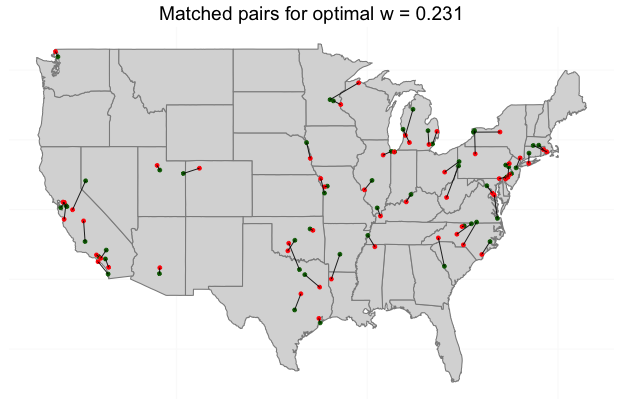
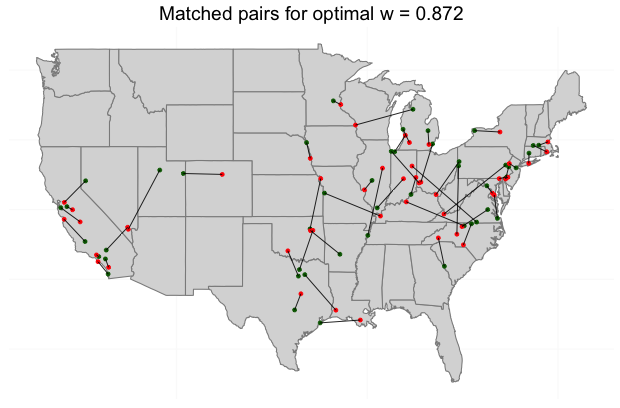

# DAPSm
Distance Adjusted Propensity Score Matching R Package

# Installing DAPSm
Installing and using DAPSm in Rstudio is straightforward. You will first need the ```devtools``` R package.
### Install and load ```devtools```
Simply write ```install.packages('devtools')``` in the console to install it, and load it using ```library(devtools)```.
### Install and load ```DAPSm```
```
library(devtools)

devtools::install_github("gpapadog/DAPSm")
```

# DAPSm example

## toyData2
toyData2 is a simulated data set where the locations of the observations are 200 power plant locations. The data set includes a binary treatment indicator Z, a continuous outcome Y, a spatial confounder U and other confounders X<sub>1</sub>, X<sub>2</sub>, X<sub>3</sub>, X<sub>4</sub>. The data set can be loaded using ```data('toyData2')```.

## Analyzing a data set

There are three main ways to analyze a data set for which we have set of observed confounders, location information (such as longitude, latitude), a binary treatment, and propensity score estimates of the treatment on the observed covariates.

### DAPSm with fixed weight

If the investigator has a prior belief of the relative importance of propensity score similarity and distance in the matching, DAPSm could be fit with fixed w expressing these beliefs.

For example, in the toyData2 data set, one could fit DAPSm with w = 0.7 by performing

```
daps <- DAPSest(toyData2, out.col = 2, trt.col = 1, caliper = 0.3,
                weight = 0.7, coords.columns = c(4, 5),
                pairsRet = TRUE, cov.cols = 6:9, cutoff = 0.1,
                coord_dist = TRUE, caliper_type = 'DAPS',
                matching_algorithm = 'greedy')
```

### DAPSm with fast search of the optimal weight

The optimal weight is defined as the minimum w for which the absolute standardized difference of means (ASDM) of all covariates is less than a cutoff.

This includes a fast search of the optimal weight. The algorithm assumes a decreasing trend in ASDM for increasing w. It starts at 0.5 and checks balance of the covariates. If balance is acheived w is decreased to 0.25. If balance is not acheived, w is increased to 0.75. The algorithm continues this way, and w is moved by 1/2<sub>n + 1</sub> at each step n.

The fast algorithm should only be used for large data sets for which an extensive search of the optimal w is not feasible.

Fit this algorithm by performing

```
daps <- DAPSest(toyData2, out.col = 2, trt.col = 1, caliper = 0.3,
                weight = 'optimal', coords.columns = c(4, 5),
                pairsRet = TRUE, cov.cols = 6:9, cutoff = 0.15,
                w_tol = 0.001, coord_dist = TRUE, caliper_type = 'DAPS')
```

### DAPSm with extensive search for the optimal weight - *Recommended*

Instead, we can fit the algorithm for varying values of w and assess balance of covariates at every step. This can be performed by

```
bal <- CalcDAPSWeightBalance(toyData2, weights = seq(0, 1, length.out = 40),
                             cov.cols = 6:9, trt.col = 1,
                             coords.columns = c(4, 5), caliper = 0.3)
```

Balance of the covariates can be assessed by checking the ASDM as a function of w using

```
PlotWeightBalance(bal$balance, weights = seq(0, 1, length.out = 40), cutoff = 0.15)
```

<br>


The function that can be used to choose the optimal weight and fit the model and return estimates is
```
DAPS <- DAPSchoiceModel(toyData2, trt.col = 1, balance = bal$balance,
                        cutoff = 0.15, pairs = bal$pairs,
                        weights = seq(0, 1, length.out = 40))
```
The weight chosen is equal to approximately 0.231.


## Plot of matched pairs.
We can plot the matched pairs for different weights. The function ```CalcDAPSWeightBalance()``` already returned information of the matched pairs for 40 different values of w. We will plot the set of matched pairs for the optimal w chosen above, as well as a larger w.

```
MatchedDataMap(x = bal$full_pairs[[10]], trt_coords = c(3, 4),
               con_coords = c(7, 8))
```




Comparing the plots of matched pairs for the two choices of w we see that for larger w the matched pairs are further away from each other. This is expected since matching weigth given to distance is decreased for increasing w.

